# 天梯赛刷题路线可视化

> 本文档使用 Mermaid 图表展示各专题刷题路线，支持 GitHub/VSCode 直接渲染

---

## 📊 总体学习路径

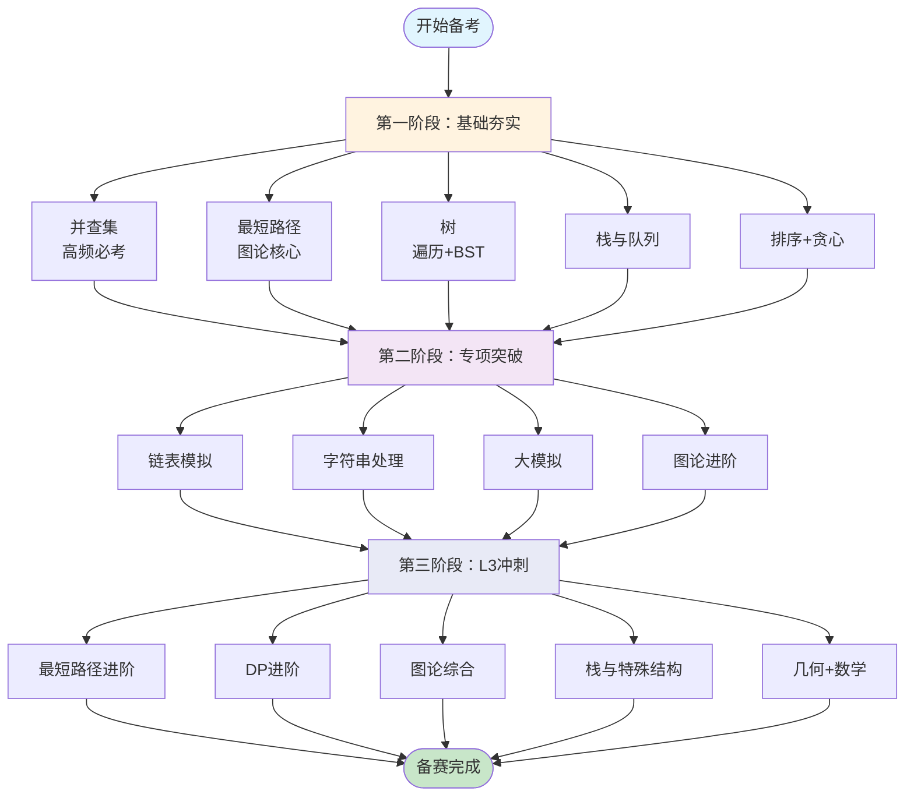

---

## 📈 L2/L3 知识点分布对比

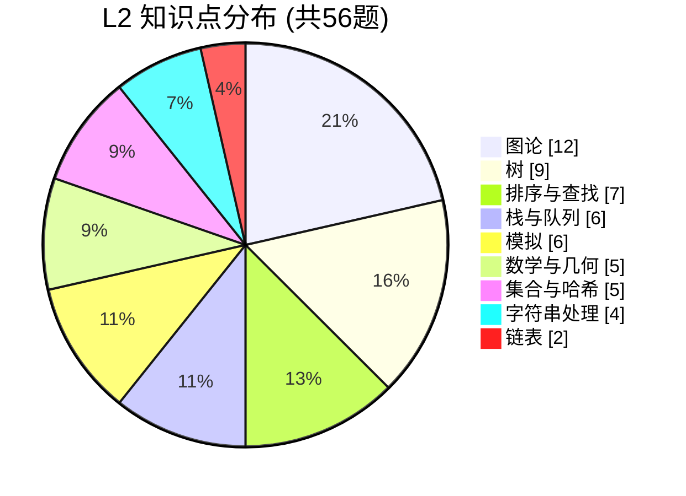

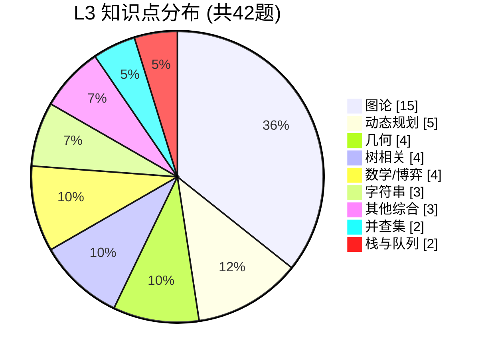

---

## 专题一：栈和队列

### 刷题路线图

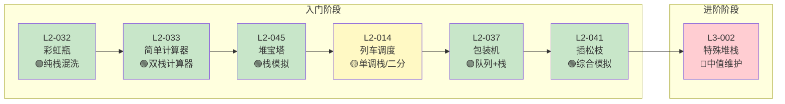

**难度说明**：🟢基础 | 🟡中等 | 🔴困难

---

## 专题二：链表模拟

### 刷题路线图

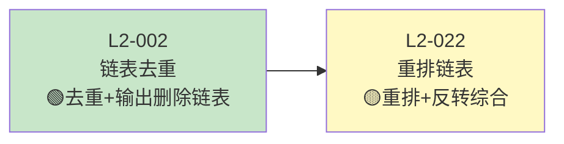

### 常见坑点

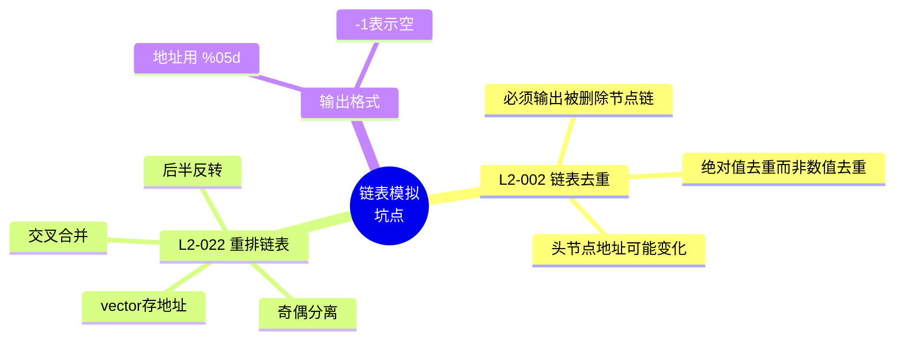

---

## 专题三：二叉树与树

### 刷题路线图

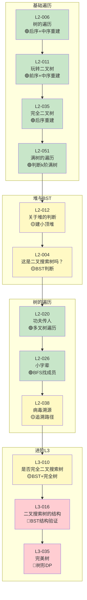

---

## 专题四：并查集 ⭐高频必考

### 刷题路线图

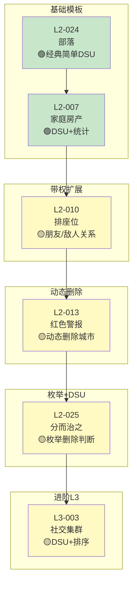

### 并查集技巧总结

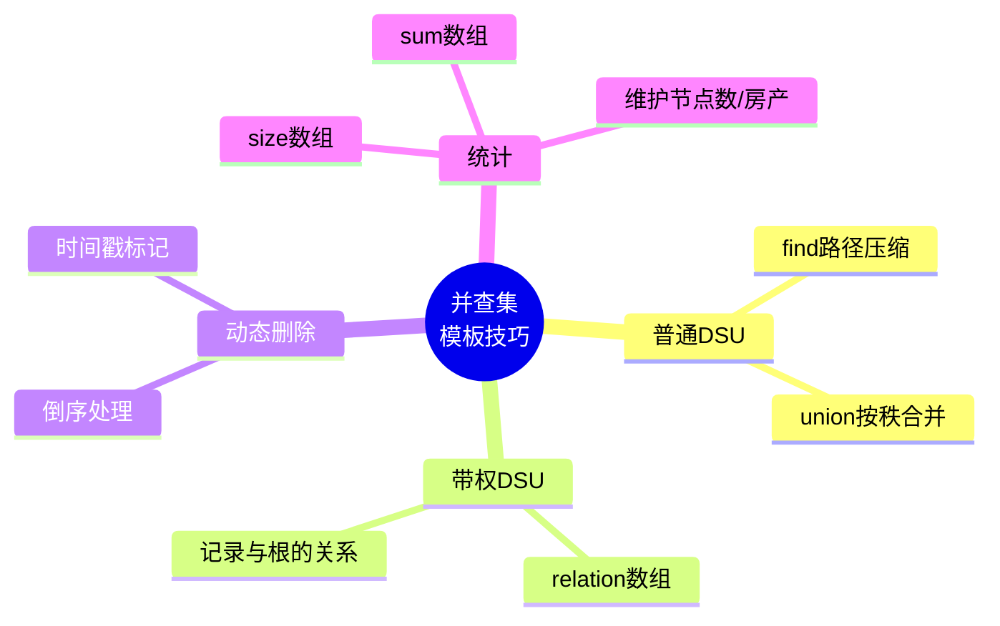

---

## 专题五：字符串处理

### 刷题路线图

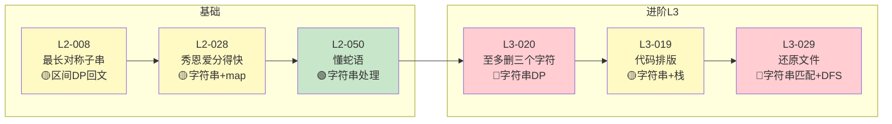

---

## 专题六：贪心+排序+集合/哈希

### 刷题路线图

```mermaid
flowchart TD
    subgraph 贪心基础
        G1[L2-003<br/>月饼<br/>🟢贪心模板] --> G2[L2-046<br/>赛场安排<br/>🟢贪心模拟]
    end
    
    subgraph 排序应用
        G2 --> G3[L2-009<br/>抢红包<br/>🟢哈希+排序]
        G3 --> G4[L2-015<br/>互评成绩<br/>🟢去极值排序]
        G4 --> G5[L2-017<br/>人以群分<br/>🟢分组差值]
        G5 --> G6[L2-027<br/>名人堂<br/>🟢排名发券]
    end
    
    subgraph 集合操作
        G6 --> G7[L2-005<br/>集合相似度<br/>🟢set交并集]
        G7 --> G8[L2-019<br/>悄悄关注<br/>🟢multiset]
        G8 --> G9[L2-021<br/>点赞狂魔<br/>🟢map+排序]
    end
    
    subgraph 综合应用
        G9 --> G10[L2-039<br/>清点代码库<br/>🟢map+排序]
        G10 --> G11[L2-053<br/>算式拆解<br/>🟡字符串/栈]
    end
    
    subgraph 进阶L3
        G11 --> L1[L3-001<br/>凑零钱<br/>🟡贪心+DP]
        L1 --> L2[L3-009<br/>长城<br/>🔴贪心+线段树]
        L2 --> L3[L3-017<br/>森森快递<br/>🔴线段树/贪心]
    end
    
    style G1 fill:#c8e6c9
    style G2 fill:#c8e6c9
    style G3 fill:#c8e6c9
    style G4 fill:#c8e6c9
    style G5 fill:#c8e6c9
    style G6 fill:#c8e6c9
    style G7 fill:#c8e6c9
    style G8 fill:#c8e6c9
    style G9 fill:#c8e6c9
    style G10 fill:#c8e6c9
    style G11 fill:#fff9c4
    style L1 fill:#fff9c4
    style L2 fill:#ffcdd2
    style L3 fill:#ffcdd2
```

---

## 专题七：最短路径

### 刷题路线图

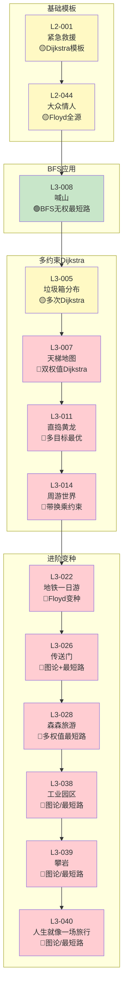

### Dijkstra 重点掌握

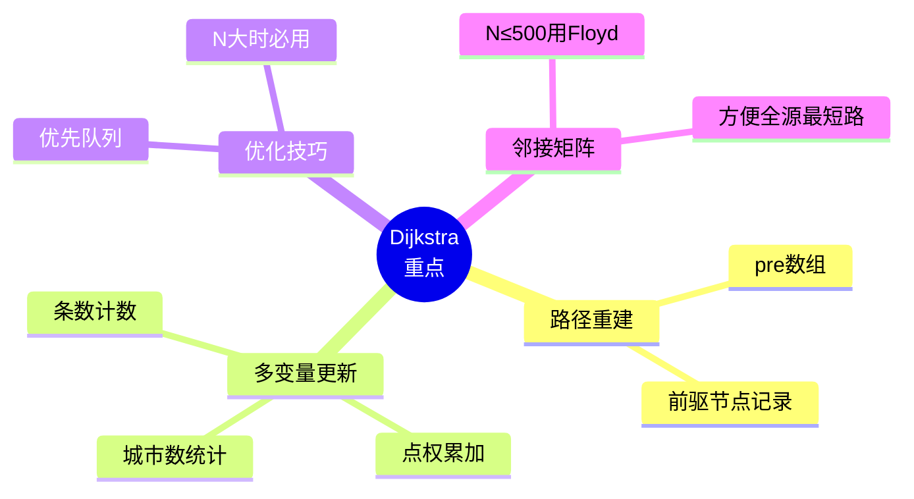

---

## 专题八：图论进阶

### 刷题路线图

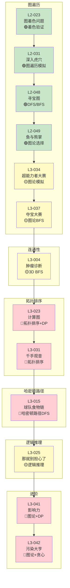

---

## 专题九：动态规划

### 刷题路线图

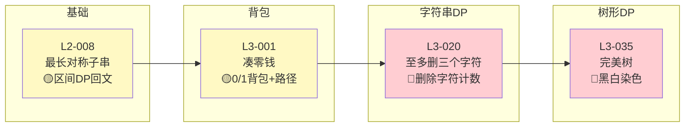

### DP 核心模板

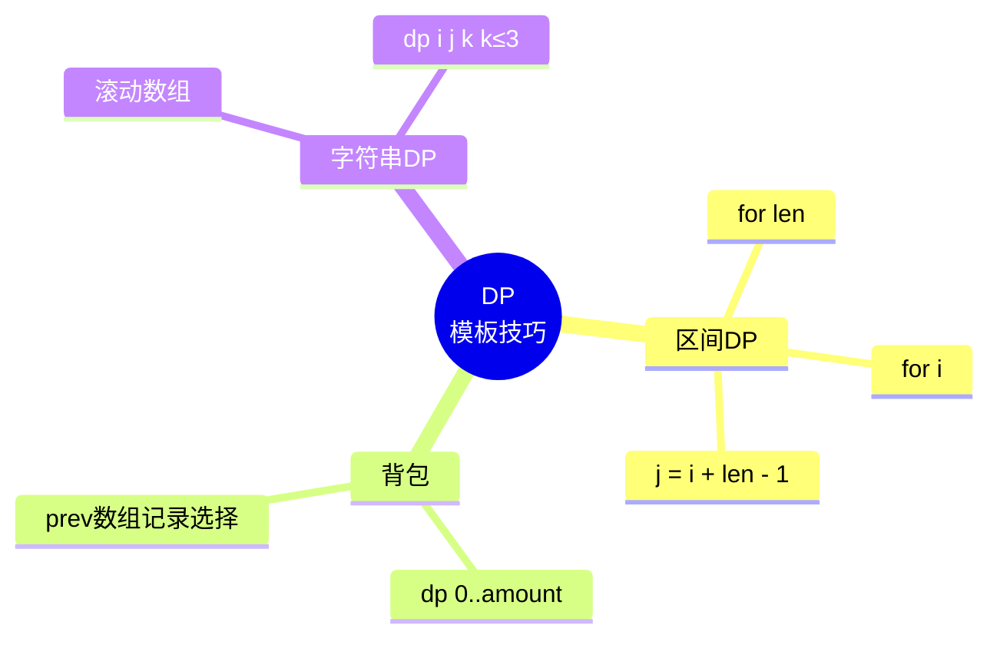

---

## 专题十：大模拟

### 刷题路线图

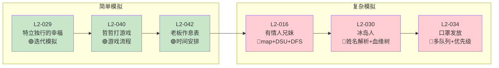

---

## 专题十一：数学与几何

### 刷题路线图

```mermaid
flowchart TD
    subgraph 数学计算
        MA1[L2-017<br/>人以群分<br/>🟢分组差值] --> MA2[L2-018<br/>多项式除法<br/>🟡多项式运算]
        MA2 --> MA3[L2-052<br/>吉利矩阵<br/>🟡矩阵计算]
        MA3 --> MA4[L2-054<br/>三点共线<br/>🟢几何判断]
        MA4 --> MA5[L2-056<br/>被n整除的n位数<br/>🟡数学/DFS]
    end
    
    subgraph 几何
        MA5 --> MA6[L3-006<br/>迎风一刀斩<br/>🔴几何/模拟]
        MA6 --> MA7[L3-012<br/>水果忍者<br/>🔴几何/双指针]
        MA7 --> MA8[L3-021<br/>神坛<br/>🔴几何/叉积]
    end
    
    subgraph 物理
        MA8 --> MA9[L3-013<br/>非常弹的球<br/>🔴物理/模拟]
    end
    
    subgraph 博弈
        MA9 --> MA10[L3-024<br/>Oriol和David<br/>🔴博弈论]
        MA10 --> MA11[L3-033<br/>教科书般的亵渎<br/>🔴数学/博弈]
        MA11 --> MA12[L3-036<br/>血染钟楼<br/>🔴博弈论]
    end
    
    subgraph 找规律
        MA12 --> MA13[L3-027<br/>可怜的复杂度<br/>🟡复杂度分析]
        MA13 --> MA14[L3-030<br/>可怜的简单题<br/>🔴数学/找规律]
    end
    
    style MA1 fill:#c8e6c9
    style MA2 fill:#fff9c4
    style MA3 fill:#fff9c4
    style MA4 fill:#c8e6c9
    style MA5 fill:#fff9c4
    style MA6 fill:#ffcdd2
    style MA7 fill:#ffcdd2
    style MA8 fill:#ffcdd2
    style MA9 fill:#ffcdd2
    style MA10 fill:#ffcdd2
    style MA11 fill:#ffcdd2
    style MA12 fill:#ffcdd2
    style MA13 fill:#fff9c4
    style MA14 fill:#ffcdd2
```

---

## 专题十二：DFS与高级搜索

### 刷题路线图

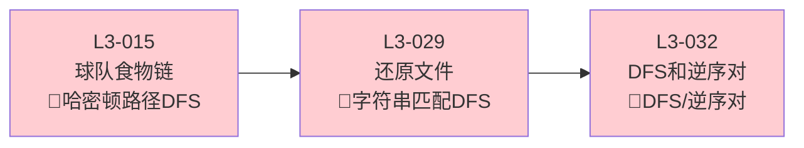

---

## 🎯 推荐刷题顺序总览

### 第一阶段：基础夯实（L2核心专题）

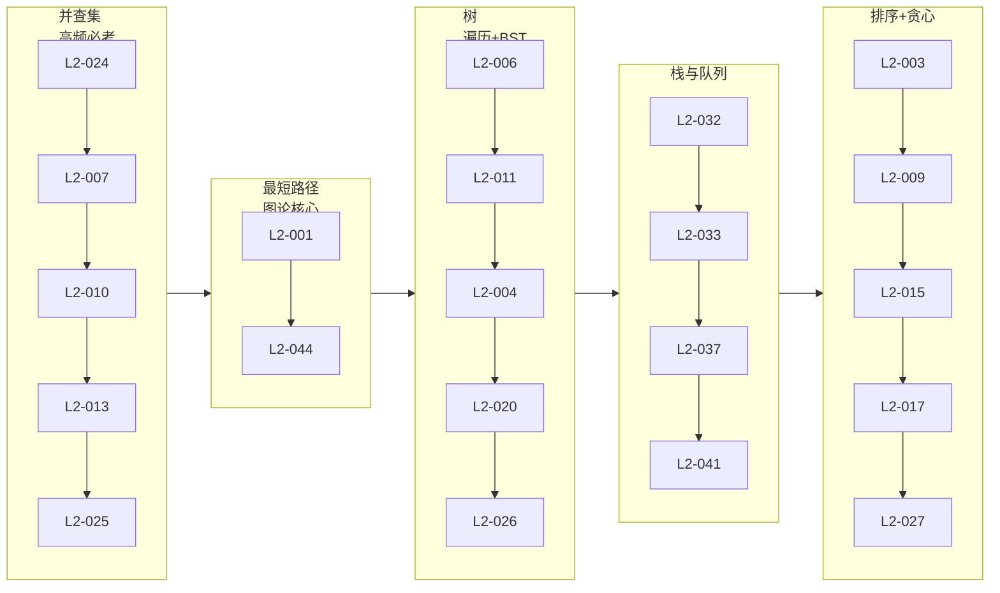

### 第二阶段：专项突破（L2进阶）

```mermaid
flowchart LR
    subgraph 6[链表模拟]
        L1[L2-002] --> L2[L2-022]
    end
    
    subgraph 7[字符串处理]
        ST1[L2-008] --> ST2[L2-028] --> ST3[L2-050]
    end
    
    subgraph 8[大模拟]
        M1[L2-029] --> M2[L2-016] --> M3[L2-030] --> M4[L2-034]
    end
    
    subgraph 9[图论进阶]
        GR1[L2-023] --> GR2[L2-031] --> GR3[L2-048]
    end
    
    6 --> 7 --> 8 --> 9
```

### 第三阶段：L3冲刺

```mermaid
flowchart LR
    subgraph 10[最短路径进阶]
        SP1[L3-008] --> SP2[L3-005] --> SP3[L3-007] --> SP4[L3-011] --> SP5[L3-014]
    end
    
    subgraph 11[DP进阶]
        DP1[L3-001] --> DP2[L3-020] --> DP3[L3-035]
    end
    
    subgraph 12[图论综合]
        G1[L3-004] --> G2[L3-015] --> G3[L3-023] --> G4[L3-031]
    end
    
    subgraph 13[栈与特殊结构]
        SS1[L3-002]
    end
    
    subgraph 14[几何+数学]
        GM1[L3-006] --> GM2[L3-012] --> GM3[L3-021]
    end
    
    10 --> 11 --> 12 --> 13 --> 14
```

---

## 📝 备考建议

```mermaid
mindmap
  root((备考建议))
    时间分配
      L2每题30分钟
      L3每题60分钟
    刷题策略
      先按专题刷
      确保专题熟练
      再进入下一专题
    代码模板
      Dijkstra
      并查集
      BFS/DFS
      区间DP
    错题复盘
      边界条件
      输出格式
      数据类型
    真题补充
      练习集刷完
      近3年真题
      补充新题型
```

---

## 🔗 使用说明

1. **查看图表**：在 GitHub、VSCode（安装 Mermaid 插件）、Typora 等支持 Mermaid 的环境中可直接渲染
2. **难度说明**：
   - 🟢 **基础**：适合入门，考察单一知识点
   - 🟡 **中等**：需要综合运用多个技巧
   - 🔴 **困难**：L3 难度或复杂实现
3. **刷题建议**：按照箭头方向依次完成，确保每个节点都理解透彻再进入下一个

---

*祝备赛顺利！🎯*
